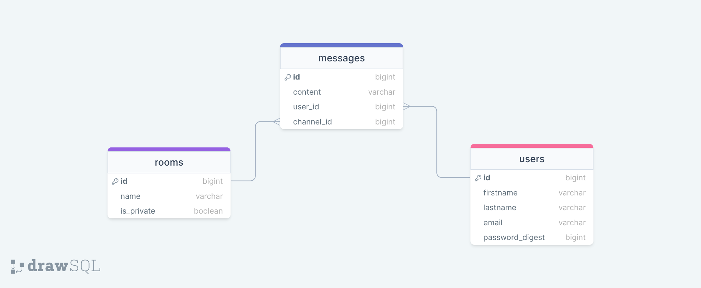

<a name="readme-top"></a>

<div align="center">
  
  <br/>

<h3><b>Chateo!</b></h3>

</div>

<!-- TABLE OF CONTENTS -->

# 📗 Table of Contents

- [📖 About the Project](#about-project)
    - [🛠 Built With](#built-with)
        - [Tech Stack](#tech-stack)
        - [Key Features](#key-features)
    - [🚀 Live Demo](#live-demo)
- [💻 Getting Started](#getting-started)
    - [Setup](#setup)
    - [Prerequisites](#prerequisites)
    - [Install](#install)
    - [Usage](#usage)
    - [Run tests](#run-tests)
    - [Deployment](#deployment)
- [👥 Authors](#authors)
- [🔭 Future Features](#future-features)
- [🤝 Contributing](#contributing)
- [⭐️ Show your support](#support)
- [🙏 Acknowledgements](#acknowledgements)
- [📝 License](#license)

<!-- PROJECT DESCRIPTION -->

# 📖 Chateo! <a name="about-project"></a>

> This is the Back-end of the Chateo! project, a real-time chat
> application. See the [Front-end](https://github.com/andrianarivo/chateo-react-ui).

**Chateo!** is a web application that allows users to chat with each other in real-time. It is built with React.js,
Express.js, GraphQL and MongoDB.

## 🛠 Built With <a name="built-with"></a>

### Tech Stack <a name="tech-stack"></a>

<details>
  <summary>Client</summary>
  <ul>
    <li><a href="https://reactjs.org/">React.js</a></li>
  </ul>
</details>

<details>
  <summary>Server</summary>
  <ul>
    <li><a href="https://expressjs.com/">Express.js</a></li>
  </ul>
</details>

<details>
<summary>Database</summary>
  <ul>
    <li><a href="https://www.mongodb.com/">MongoDB</a></li>
    <li>ERD:
      
    </li>
  </ul>
</details>

<!-- Features -->

### Key Features <a name="key-features"></a>

- **Auth: Login/Logout**
- **Auth: Register**
- **Direct Messages**
- **Rooms (aka. Channels)**
- **UI/UX**

<p align="right">(<a href="#readme-top">back to top</a>)</p>

<!-- LIVE DEMO -->

## 🚀 Live Demo <a name="live-demo"></a>

- [Live Demo Link](https://astonishing-biscuit-7921d9.netlify.app/login)

<p align="right">(<a href="#readme-top">back to top</a>)</p>

<!-- GETTING STARTED -->

## 💻 Getting Started <a name="getting-started"></a>

To get a local copy up and running, follow these steps.

### Prerequisites

In order to run this project you need:

- **[Node.js](https://nodejs.org/en/)**
- **[npm](https://www.npmjs.com/)** or **[yarn](https://yarnpkg.com/)**
- Stable internet connection
- A modern web browser
- A terminal
- A code editor

### Setup

Clone this repository to your desired folder:

```sh
  cd my-folder
  git clone https://github.com/andrianarivo/chateo-react-ui.git
```

### Install

Install this project with:

```sh
  cd my-project
  yarn install; cp .env.example .env
```

### Usage

To run the project, execute the following command:

- In development mode:

```sh
  yarn dev
```

- In production mode:

```sh
  yarn build; yarn start
```

### Run tests

**There are no tests yet, please be patient.**

To run tests, run the following command:

```sh
  yarn test
```

### Deployment

You can deploy this project using your own deployment solution.

<p align="right">(<a href="#readme-top">back to top</a>)</p>

<!-- AUTHORS -->

## 👥 Authors <a name="authors"></a>

👤 **David**

- GitHub: [@andrianarivo](https://github.com/andrianarivo)
- Twitter: [@dandrianarivo](https://twitter.com/dandrianarivo)
- LinkedIn: [LinkedIn](https://linkedin.com/in/andrianarivo)

<p align="right">(<a href="#readme-top">back to top</a>)</p>

<!-- FUTURE FEATURES -->

## 🔭 Future Features <a name="future-features"></a>

- [ ] **Forgot Password**
- [ ] **Delete rooms**
- [ ] **Improve UI/UX**
- [ ] **Markdown**

<p align="right">(<a href="#readme-top">back to top</a>)</p>

<!-- CONTRIBUTING -->

## 🤝 Contributing <a name="contributing"></a>

Contributions, issues, and feature requests are welcome!

Feel free to check the [issues page](https://github.com/andrianarivo/chateo-nodejs/issues/).

<p align="right">(<a href="#readme-top">back to top</a>)</p>

<!-- SUPPORT -->

## ⭐️ Show your support <a name="support"></a>

If you like this project consider adding a ⭐️

<p align="right">(<a href="#readme-top">back to top</a>)</p>

<!-- ACKNOWLEDGEMENTS -->

## 🙏 Acknowledgments <a name="acknowledgements"></a>

I would like to thank:

- Novity for the opportunity to work on this project.
- <a href="https://www.flaticon.com/free-icons/speak" title="speak icons">Speak icons created by Freepik - Flaticon</a>
  for the icons.

<p align="right">(<a href="#readme-top">back to top</a>)</p>

<!-- LICENSE -->

## 📝 License <a name="license"></a>

This project is [MIT](./LICENSE) licensed.

<p align="right">(<a href="#readme-top">back to top</a>)</p>